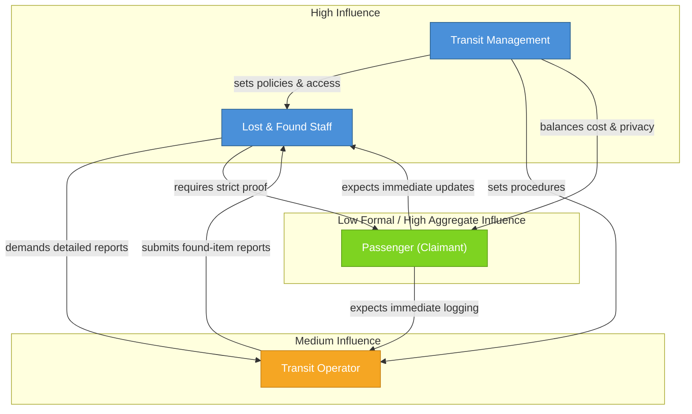

# Stakeholders

## Public Transit Lost & Found System

---

## Stakeholder 1 – Passenger (Lost-Item Claimant)

| Attribute | Detail |
|---|---|
| **Role / Name** | Passenger who lost an item on TTC transit |
| **Interest** | Report a lost item and recover it quickly and conveniently without spending hours on hold or traveling to Bay Station just to inquire. |
| **Goals** | Report lost items easily; receive automated status updates; determine whether the item has been found; prove ownership; reclaim the item before retention limits expire. |
| **Responsibilities** | Provide honest, detailed identifying marks (not generic guesses); retain the claim tracking code; present government-issued photo ID and verify ownership upon pickup. |
| **Information / Services Needed** | A public portal to report missing property; a masked search/inquiry tool for browsing found items; automated email/SMS status tracking; clear pickup instructions for Bay Station. |
| **Concerns / Risks** | **Privacy** – entering personal identity info into a web form that could be mishandled. **Fraud** – another person spotting a listed item and fraudulently claiming it first. **Premature loss of hope** – searching shortly after loss, finding nothing, and assuming the item is gone because physical transit logistics take 24–48 hours. |
| **Influence / Decision Power** | Low formal decision power over how the TTC builds the system, but high aggregate influence — if passengers find the portal confusing or untrustworthy, they will bypass it and overwhelm the phone lines. |
| **Likely Conflicts with Other Stakeholders** | **With Transit Operators:** Passengers expect immediate logging the moment an operator picks up an item, but drivers must prioritize transit schedules and safety. **With Lost & Found Staff:** Claimants may become frustrated with the strict proof-of-ownership required before high-value items are released. |
| **How Knowledge Was Obtained** | **[Fact]** The TTC Lost Articles Office counter is at Bay Subway Station, with phone inquiry lines open only Monday–Friday, 12:00 PM–5:00 PM. **[Analogy]** Passenger behaviors on systems like Transport for London and airline baggage portals show that lack of automated case tracking causes high drop-off and repeated calls. **[Assumption]** Most riders will search for or report their item from a smartphone within 6 hours of realizing it was left behind. |

---

## Stakeholder 2 – Transit Operator (Frontline Transit Employee)

| Attribute | Detail |
|---|---|
| **Role / Name** | Transit Operator / Frontline Transit Employee (bus drivers, streetcar operators, station collectors) |
| **Interest** | Ensure lost items found on transit vehicles or handed in by passengers enter the lost-and-found process correctly, with a quick process that does not significantly interrupt normal duties. |
| **Goals** | Report found items with minimal effort; provide useful details (item type, location, route, vehicle, approximate time found); ensure the physical item reaches the appropriate lost-and-found location. |
| **Responsibilities** | Receive or identify found items on vehicles; submit relevant information through the proposed system; transfer or store the physical item according to transit procedures. |
| **Information / Services Needed** | A simple, streamlined reporting interface; fields for item description, category, time, route, vehicle, and location; submission confirmation; instructions for handling or transferring the physical item. |
| **Concerns / Risks** | Reporting could interfere with active transit duties and schedules. Incomplete information could reduce matching accuracy. Valuable or personal items could be mishandled during the handoff process. |
| **Influence / Decision Power** | Medium — operator reports directly affect the quality of information available to lost-and-found staff and the speed of the matching process. |
| **Likely Conflicts with Other Stakeholders** | **With Lost & Found Staff:** Staff may want detailed, structured reports, while operators prefer shorter forms that take minimal time. **With Passengers:** Passengers may expect immediate help, while operators can only report or transfer the item and must return to service. |
| **How Knowledge Was Obtained** | **[Fact]** Public transit lost-and-found procedures were reviewed from TTC and other agencies. **[Analogy]** Existing transit systems were used as analogies for operator workflows. **[Assumption]** Transit operators value fast reporting, minimal disruption, clear instructions, and simple forms — these goals and concerns are primarily team assumptions requiring future validation. |

---

## Stakeholder 3 – Lost & Found Staff (Central Inventory / Claims Officer)

| Attribute | Detail |
|---|---|
| **Role / Name** | Lost & Found Staff / Central Inventory Claims Officer at Bay Station |
| **Interest** | Ensuring the centralized lost-and-found repository operates systematically; incoming item records are kept up-to-date; genuine owners are accurately matched while eliminating fraud and administrative backlogs. |
| **Goals** | Minimize time spent manually cross-referencing lost reports against physical inventory; verify ownership claims with high accuracy to prevent releasing property to fraudulent claimants; streamline outbound dispatching for owner pickup or delivery. |
| **Responsibilities** | Cataloging and categorizing physical items received from transit vehicles and depots; reviewing and evaluating match candidates flagged by the system; validating proof-of-ownership documentation; managing secure storage; approving items for handoff or third-party delivery. |
| **Information / Services Needed** | Automated matching algorithms that connect item attributes; a streamlined verification interface showing claimant evidence against item logs; an audit trail for item custody changes; integration with a delivery partner API for shipment dispatch. |
| **Concerns / Risks** | Releasing an item to the wrong individual due to vague descriptions; inventory overflow caused by poor data entry from depot personnel; reputational or legal fallout from lost, damaged, or mishandled high-value belongings. |
| **Influence / Decision Power** | High operational decision power regarding system usability, verification criteria, and claim approval/rejection workflows. Can reject system features that add unnecessary friction to daily inventory reconciliation. |
| **Likely Conflicts with Other Stakeholders** | **With Passengers:** Staff require stringent proof of ownership and detailed descriptions, which frustrated passengers may perceive as excessive delay or bureaucratic gatekeeping. **With Transit Operators:** Staff need granular, structured item intake details, whereas drivers want ultra-quick, minimal logging. **With Delivery Partners (if applicable):** Staff require signed chain-of-custody confirmation and prompt pickup, while couriers prioritize strict timetables. |
| **How Knowledge Was Obtained** | **[Fact]** Review of public intake and claim guidelines from metropolitan transit systems (TTC Toronto, STM Montreal, Transport for London) — these clearly state claim holding periods, proof-of-identity mandates, and item intake categories. **[Analogy]** Workflows modeled on airport lost-and-found systems (e.g., SITA WorldTracer) and parcel return centers, where multi-attribute matching and chain-of-custody logging are standard. **[Assumption]** We assume staff are willing to adopt an automated match-scoring interface rather than sticking to legacy physical logbooks, and that they possess standard digital literacy to review uploaded claimant images and dispatch delivery requests through a web portal. |

---

## Stakeholder 4 – Transit Management (Transit Agency Administration)

| Attribute | Detail |
|---|---|
| **Role / Name** | Transit Management / Transit Agency Administration |
| **Interest** | Ensuring the lost-and-found process is efficient, consistent, secure, and aligned with agency procedures. Management wants minimal manual work while improving the quality of lost-item records and public trust. |
| **Goals** | Ensure lost and found items are handled using a standardized process; improve tracking and accountability for reported items; reduce delays, missing information, and unnecessary administrative effort; support a reliable service for passengers. |
| **Responsibilities** | Establish policies and procedures for handling lost property; define staff responsibilities and access permissions; oversee compliance with privacy, security, and operational requirements; approve or support changes to the lost-and-found process. |
| **Information / Services Needed** | Access to reports and system statistics; ability to manage staff roles or permissions; visibility into item status and overall lost-and-found activity; tools for reviewing system performance and identifying recurring problems. |
| **Concerns / Risks** | Data breaches or improper access to personal information; inaccurate records or poor staff adoption; increased workload if the system is difficult to use; system failures disrupting lost-and-found operations. |
| **Influence / Decision Power** | High — management would likely approve policies, workflows, access rules, and deployment decisions. |
| **Likely Conflicts with Other Stakeholders** | **With Staff:** Staff may prefer simpler workflows, while management may require more documentation and audit trails. **With Passengers:** Passengers want more transparency or faster service, while management must balance cost, privacy, and operational constraints. |
| **How Knowledge Was Obtained** | **[Fact]** The team reviewed publicly available transit agency information about lost-and-found procedures, staff responsibilities, privacy, and operational policies. **[Analogy]** Existing transit lost-and-found services were used to understand the likely role of management in overseeing workflows, policies, and staff access. **[Assumption]** Transit management prioritizes operational efficiency, standardized procedures, privacy, accountability, accurate record keeping, system reliability, and reporting tools that support oversight of lost-and-found activities. |

---

## Stakeholder Map

### Stakeholder Relationship Summary

| Relationship | Nature | Key Tension |
|---|---|---|
| Passenger ↔ Lost & Found Staff | Claimant ↔ Verifier | Passengers want speed; staff need proof |
| Passenger ↔ Transit Operator | Reporter ↔ Finder | Passengers expect immediate action; operators have schedule constraints |
| Transit Operator ↔ Lost & Found Staff | Data provider ↔ Data consumer | Staff want detailed data; operators want quick forms |
| Transit Management ↔ Lost & Found Staff | Policy setter ↔ Executor | Management adds oversight; staff want simplicity |
| Transit Management ↔ Passenger | Service provider ↔ Service user | Management balances cost/privacy; passengers want transparency |
